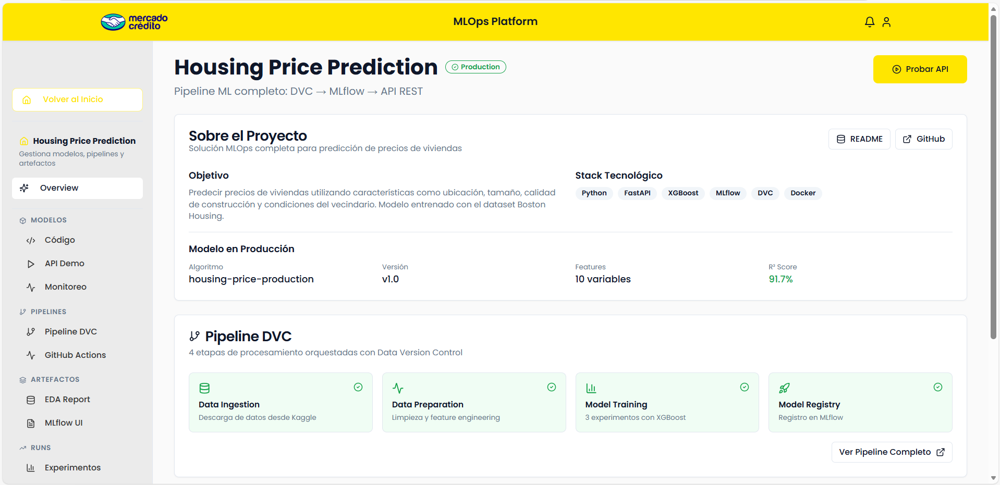
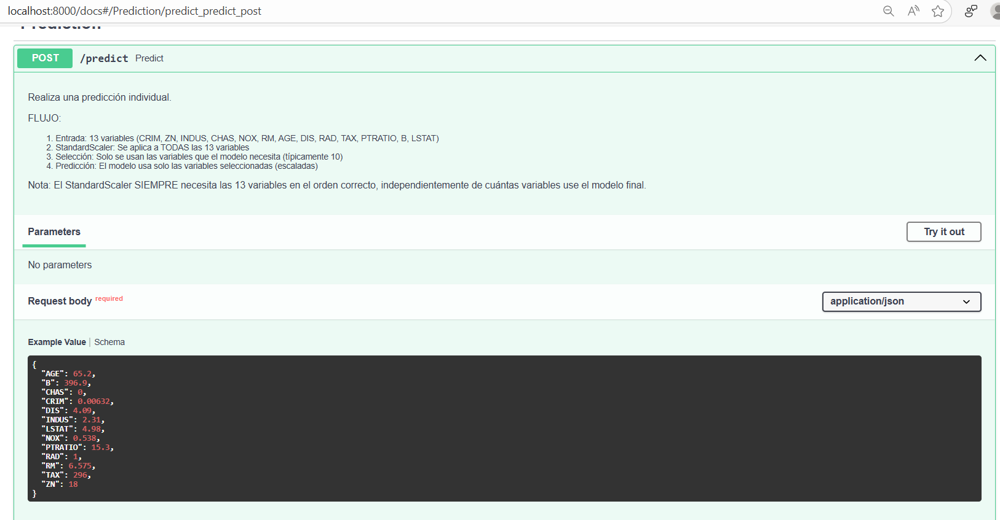
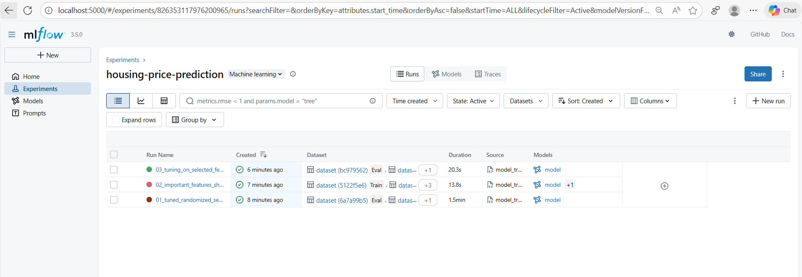

# 🏠 Predicción de Precios de Viviendas - Sistema MLOps Completo

[](https://github.com/marestrepohi/meli-mlops-mateo-restrepo/actions)
[](https://www.python.org/downloads/)
[](https://fastapi.tiangolo.com/)
[](https://mlflow.org/)
[](https://docs.docker.com/compose/)
[](https://github.com/features/copilot)
[](LICENSE)

---
## 👤 Autor

**Mateo Restrepo**
- GitHub: [@marestrepohi](https://github.com/marestrepohi)
- LinkedIn: [mateo-restrepo](https://www.linkedin.com/in/mateorestrepohiguita-datascientist/)
---


<div align="center">

## 🎥 Video Demo del Proyecto

[](https://drive.google.com/file/d/1MZXWTC2SF8O0-vJjvufFEhiZZ7-SA7KM/view?usp=sharing)

### 🎯 Dashboard MLOps Completo


### 🔵 API REST con FastAPI


### 📊 MLflow Tracking UI


</div>

---

> 🤖 **Sistema completo y producción-ready de MLOps** para predicción de precios de viviendas. 
> Solución agnóstica a la nube con tecnologías open-source, pipeline reproducible, API REST, monitoreo continuo y CI/CD automatizado. 
> **Este proyecto fue co-creado con GitHub Copilot** integrando técnicas modernas de IA en todo el ciclo de desarrollo.

---

## 📋 Objetivo del Proyecto

Este proyecto implementa una **solución end-to-end de Machine Learning Operations (MLOps)** para predecir precios de viviendas utilizando el dataset Boston Housing. 

### 🎯 Objetivos Clave

1. ✅ **Reproducibilidad Total**: Pipeline versionado con DVC y Git
2. ✅ **Agnóstico a Cloud**: Solo herramientas open-source y self-hosted
3. ✅ **Monitoreo en Tiempo Real**: Tracking de performance, latencia y data drift
4. ✅ **Escalabilidad**: Arquitectura containerizada lista para Kubernetes
5. ✅ **Mantenibilidad**: Código modular, documentado y testeado
6. ✅ **Automatización**: CI/CD completo con GitHub Actions
7. ✅ **Interferencia Óptima**: API REST con validación y seguridad


## �🚀 Inicio Rápido - 2 Opciones

### Opción 1️⃣: Con Docker - Makefile (RECOMENDADO - Más Fácil)

**Requisitos:**
- ✅ Docker y linux instalado (descargar desde https://www.docker.com/products/docker-desktop)
- ✅ Git

**Pasos:**

```bash
# 1. Clonar el repositorio
git clone https://github.com/marestrepohi/meli-mlops-mateo-restrepo.git
cd meli-mlops-mateo-restrepo


# 1. Iniciar todos los servicios (DVC Pipeline + API + MLflow + Frontend)

make start          -  Construir + Iniciar todos los servicios (RECOMENDADO)

## Otros comandos
make build          - Construir todas las imágenes Docker
make up             - Iniciar todos los servicios (API, MLflow, Frontend)
make down           - Detener y remover todos los contenedores
make restart        - Reiniciar todos los servicios


```

**¿Qué sucede automáticamente?**
```
├─ 1. Pipeline DVC se ejecuta (descarga datos, prepara, entrena modelo)
├─ 2. Mejor modelo se exporta a models/production/latest/
├─ 3. MLflow UI se inicia en puerto 5000
├─ 4. FastAPI inicia en puerto 8000
└─ 5. Frontend Vite inicia en puerto 8080
```

---

### Opción 2️⃣: Pasos Manuales (Setup Local)

**Requisitos:**
- ✅ Python 3.11+ instalado
- ✅ Git

**Pasos:**

```bash
# 1. Clonar repositorio
git clone https://github.com/marestrepohi/meli-mlops-mateo-restrepo.git
cd meli-mlops-mateo-restrepo
cp .env.example .env

# 2. Crear entorno virtual
python3 -m venv venv
source venv/bin/activate           # En Mac/Linux


# 3. Instalar dependencias Python
pip install -r requirements.txt

# 4. Ejecutar pipeline DVC (data + training)
dvc init               # Solo la primera vez
dvc repro

# 5. En terminal 1: Iniciar API
uvicorn api.main:app --reload --port 8000

# 6. En terminal 2: Iniciar MLflow UI
mlflow ui --port 5000

# 8. En terminal 3: Iniciar Frontend
cd front && npm install && npm run dev
```

---

## 📊 Servicios Disponibles

| Servicio | Puerto | URL | Descripción |
|----------|--------|-----|-------------|
| **API (FastAPI)** | 8000 | http://localhost:8000 | REST API con predicciones en tiempo real |
| **Swagger Docs** | 8000 | http://localhost:8000/docs | Documentación interactiva |
| **MLflow UI** | 5000 | http://localhost:5000 | Tracking de experimentos y modelos |
| **Frontend** | 8080 | http://localhost:8080 o http://localhost:8082 | Dashboard web interactivo |

---
## 🧪 Testear la API

### Test 1: Health Check (Verificar que API está activa)

```bash
curl http://localhost:8000/health
```

**Respuesta esperada:**
```json
{
  "status": "healthy",
  "model_loaded": true,
  "scaler_loaded": true,
  "model_name": "boston_housing_xgboost",
  "model_version": "1.0",
  "total_predictions": 0
}
```

---

### Test 2: Predicción Individual (Puerto 8000)

**Ejemplo: Predecir precio de una vivienda en Boston**

```bash
curl -X POST http://localhost:8000/predict \
  -H "Content-Type: application/json" \
  -d '{
    "CRIM": 0.00632,
    "ZN": 18.0,
    "INDUS": 2.31,
    "CHAS": 0.0,
    "NOX": 0.538,
    "RM": 6.575,
    "AGE": 65.2,
    "DIS": 4.09,
    "RAD": 1.0,
    "TAX": 296.0,
    "PTRATIO": 15.3,
    "B": 396.90,
    "LSTAT": 4.98
  }'
```

**Respuesta esperada:**
```json
{
  "prediction": 24.5,
  "model_name": "boston_housing_xgboost",
  "model_version": "v1.0",
  "model_stage": "Production",
  "inference_time": 12.34,
  "features_used": ["CRIM", "NOX", "RM", "AGE", "DIS", "RAD", "TAX", "PTRATIO", "B", "LSTAT"]
}
```

---

### Test 3: Predicciones en Batch

```bash
curl -X POST http://localhost:8000/predict/batch \
  -H "Content-Type: application/json" \
  -d '{
    "data": [
      {"CRIM": 0.00632, "NOX": 0.538, "RM": 6.575, "AGE": 65.2, "DIS": 4.09, "RAD": 1, "TAX": 296, "PTRATIO": 15.3, "B": 396.9, "LSTAT": 4.98},
      {"CRIM": 0.02731, "NOX": 0.469, "RM": 6.421, "AGE": 78.9, "DIS": 4.9671, "RAD": 2, "TAX": 242, "PTRATIO": 17.8, "B": 396.9, "LSTAT": 9.14}
    ]
  }'
```

**Respuesta esperada:**
```json
{
  "predictions": [
    {
      "index": 0,
      "prediction": 24.5,
      "inference_time_ms": 8.23
    },
    {
      "index": 1,
      "prediction": 21.8,
      "inference_time_ms": 7.45
    }
  ],
  "count": 2,
  "model_version": "v1.0",
  "total_inference_time": 15.68,
  "avg_inference_time": 7.84
}
```


## 🔄 Flujo del Proyecto 

### Fase 1️⃣: Experimentación y Exploración (Notebooks)

**Archivos:** 
- `notebooks/data_extract_eda.ipynb` - Análisis Exploratorio de Datos
- `notebooks/model_train.ipynb` - Experimentación con modelos

En esta fase inicial, se realiza:

```
1. Descargar datos de Kaggle (Boston Housing)
2. Análisis Exploratorio de Datos (EDA):
   - Distribuciones de variables
   - Correlación de features
   - Detección de outliers
3. Generación de reportes automatizados con ydata-profiling
4. Experimentación con diferentes modelos y hiperparámetros
5. Validación de resultados
```

**Salida:** 
- Reportes en `data/reports/eda_data.json`
- Insights sobre variables más importantes
- Decisiones de modelo para pipeline

---

### Fase 2️⃣: Pipeline DVC (Reproducibilidad)

**Archivos:** `dvc.yaml`, `params.yaml`, `src/*.py`

Basado en los aprendizajes de la experimentación, se creó un **pipeline automatizado** con 4 etapas:

#### 📥 Etapa 1: Data Ingestion (`src/data_ingestion.py`)
```bash
- Descarga datos de Kaggle API
- Genera reporte EDA automático
- Output: data/raw/HousingData.csv
```

#### 🧹 Etapa 2: Data Preparation (`src/data_preparation.py`)
```bash
- Limpieza de valores nulos (mediana/moda)
- Split train/test (80/20 con seed=42)
- StandardScaler para normalización
- Output: data/processed/*.csv + models/production/latest/scaler.pkl
```

#### 🤖 Etapa 3: Model Training (`src/model_train.py`)
```bash
Ejecuta 3 EXPERIMENTOS XGBoost con MLflow:

✅ Experimento 1 - Hyperparameter Tuning (Todas las 13 features)
   ├─ RandomizedSearchCV con 50 iteraciones
   ├─ 5-fold cross-validation

✅ Experimento 2 - Feature Importance con SHAP
   ├─ Selecciona top features (percentil 20)
   ├─ ~10 features más importantes

✅ Experimento 3 - Tuning en Features Seleccionadas ⭐ GANADOR
   ├─ Hiperparámetros optimizados para features seleccionadas
   ├─ Balance entre performance y complejidad


🏆 El MEJOR modelo (Experimento 3) se exporta AUTOMÁTICAMENTE a:
   - models/production/latest/model.pkl
   - models/production/latest/scaler.pkl
   - models/production/latest/metadata.json
```

#### 📦 Etapa 4: Model Registration (`src/model_register.py`)
```bash
- Lee metadata del mejor modelo (generada por model_train.py)
- Registra automáticamente en MLflow Model Registry
- Transiciona a stage "Production"
- Agrega tags y documentación
- Archiva versiones antiguas
```

**Ejecución del pipeline:**

El pipeline está implementado con **DVC** para reproducibilidad completa:

```bash
dvc repro                    # Ejecuta TODO el pipeline
dvc dag                      # Visualiza DAG del pipeline
make dvc-repro              # Ejecuta desde Make
```

---

### Fase 3️⃣: API REST para Producción (FastAPI)

**Archivo:** `api/main.py`

Una vez el modelo está entrenado y registrado, se **consume automáticamente** en la API:

#### 🔵 Endpoints Principales:

```bash
✅ Health Check
GET /health
→ Verifica que el modelo está cargado

✅ Predicción Individual  
POST /predict
{
  "CRIM": 0.00632,
  "NOX": 0.538,
  "RM": 6.575,
  "AGE": 65.2,
  "DIS": 4.09,
  "RAD": 1.0,
  "TAX": 296.0,
  "PTRATIO": 15.3,
  "B": 396.90,
  "LSTAT": 4.98
}
→ Retorna predicción + metadata

✅ Predicciones en Batch
POST /predict/batch
{"data": [... múltiples registros ...]}
→ Procesa varios registros eficientemente

✅ Métricas de Monitoreo
GET /metrics
→ Total predicciones, latencia, uptime

✅ Detección de Drift
GET /monitoring/drift
→ Compara con baseline para detectar cambios

✅ Dashboard de Monitoreo
GET /monitoring/dashboard
→ HTML interactivo con métricas en tiempo real
```


### Fase 4️⃣: Monitoreo Continuo

**Archivo:** `api/monitoring.py`

Tracking automático de predicciones en producción:

```bash
✅ Métricas capturadas:
   - Total de predicciones
   - Tiempo de inferencia (p50, p95, p99)
   - Distribución de predicciones
   - Detección de data drift

✅ Baselines:
   - Se pueden configurar manualmente
   - Detecta cambios en distribución
   - Alerta si hay drift significativo
```

---

## 📊 Monitoreo

Sistema de monitoreo completo implementado en `api/monitoring.py`:

### Métricas Rastreadas

1. **Performance Metrics**
   - Total de predicciones
   - Uptime del servicio
   - Predicciones por hora

2. **Latency Metrics**
   - Tiempo promedio de inferencia
   - Percentiles: p50, p95, p99
   - Tiempo máximo de inferencia

3. **Prediction Statistics**
   - Media, mediana, std de predicciones
   - Min/max values
   - Distribución de predicciones

4. **Data Drift Detection**
   - Comparación vs baseline (mean ± 2σ)
   - Drift score por feature
   - Alertas automáticas

### Configurar Baseline para Drift Detection

```python
from api.monitoring import monitor

# Configurar baseline con datos históricos
historical_predictions = [20.5, 22.3, 19.8, ...]
historical_features = {
    'CRIM': [0.1, 0.2, ...],
    'RM': [6.0, 6.5, ...]
}

monitor.set_baseline(historical_predictions, historical_features)
```

---

### Fase 5️⃣: Frontend Interactivo

**Carpeta:** `front/`

Interfaz web moderna con React + Vite:

```bash
✅ Formulario para hacer predicciones
✅ Visualización de resultados en tiempo real
✅ Dashboard de monitoreo con gráficos
✅ Histórico de predicciones
✅ Estadísticas de performance
```

**Acceso:** http://localhost:8080

---

### Fase 6️⃣: CI/CD Automatizado (GitHub Actions)

**Carpeta:** `.github/workflows/`

Automatización completa en cada push:

```bash
✅ mlops-ci-cd.yml (Pipeline Principal)
   1. Code Quality: flake8 + pytest
   2. Train Model: Ejecuta DVC pipeline
   3. Build Docker: Construye imágenes
   4. Test API: Verifica todos los endpoints
   5. Deploy: Prepara para producción

✅ Ejecución automática en:
   - Push a main/develop
   - Pull requests
   - Manual workflow_dispatch
```

---

## 📂 Estructura Completa del Proyecto

```
meli-mlops-mateo-restrepo/
│
├── 📓 NOTEBOOKS (Experimentación y EDA)
│   ├── notebooks/data_extract_eda.ipynb        # EDA interactivo del dataset
│   └── notebooks/model_train.ipynb             # Experimentación con modelos
│
├── 🔄 PIPELINE DVC (Reproducibilidad Total)
│   ├── dvc.yaml                                # Definición DAG del pipeline
│   ├── params.yaml                             # Hiperparámetros centralizados
│   └── src/
│       ├── config.py                           # Configuración global
│       ├── data_ingestion.py                   # Etapa 1: Descargar datos
│       ├── data_preparation.py                 # Etapa 2: Limpieza + split + scale
│       ├── model_train.py                      # Etapa 3: 3 experimentos XGBoost
│       └── model_register.py                   # Etapa 4: Registrar en MLflow
│
├── 🔵 API REST (FastAPI con Monitoreo)
│   ├── api/main.py                             # API principal + endpoints
│   ├── api/monitoring.py                       # Monitoreo + drift detection
│   └── api/__init__.py
│
├── 🌐 FRONTEND (React + Vite + Tailwind)
│   ├── front/src/
│   │   ├── components/                         # Componentes React
│   │   ├── pages/                              # Páginas
│   │   ├── services/                           # Llamadas a API
│   │   └── main.tsx
│   ├── front/package.json
│   ├── front/vite.config.ts
│   └── front/tailwind.config.ts
│
├── 🐳 DOCKER (Contenedorización)
│   ├── Dockerfile                              # Imagen Python backend
│   ├── docker-compose.yml                      # Orquestación servicios
│   └── .dockerignore
│
├── 🤖 CI/CD (GitHub Actions)
│   └── .github/workflows/
│       ├── mlops-ci-cd.yml                     # Pipeline principal
│       └── mlops-pipeline-ultra-simple.yml.old # Versión simplificada
│
├── 📊 DATOS (Versionados con DVC)
│   ├── data/raw/                               # Datos originales de Kaggle
│   ├── data/processed/                         # Datos preprocesados (train/test)
│   ├── data/predictions/                       # Histórico de predicciones
│   └── data/reports/                           # Reportes EDA JSON/HTML
│
├── 🎯 MODELOS (Producción Ready)
│   ├── models/production/latest/
│   │   ├── model.pkl                           # Modelo XGBoost entrenado
│   │   ├── scaler.pkl                          # StandardScaler serializado
│   │   └── metadata.json                       # Features, métricas, timestamps
│   └── mlruns/                                 # MLflow experiment tracking
│
└── 📋 CONFIGURACIÓN DEL PROYECTO
    ├── Makefile                                # Comandos Docker simplificados
    ├── requirements.txt                        # Dependencias Python
    ├── README.md                               
    ├── dvc.yaml
    ├── params.yaml
    └── .env.example
 
---

## 🏗️ Arquitectura Docker

### Docker Compose - Arquitectura Multi-Contenedor

El proyecto utiliza **Docker Compose** con una arquitectura de 3 servicios independientes:

```yaml
┌─────────────────────────────────────────────────────────────┐
│                   Docker Compose Network                     │
│                  (mlops-housing-network)                     │
├─────────────────────────────────────────────────────────────┤
│                                                              │
│  ┌──────────────┐  ┌──────────────┐  ┌──────────────┐     │
│  │   Backend    │  │   MLflow     │  │   Frontend   │     │
│  │   Container  │  │   Container  │  │   Container  │     │
│  ├──────────────┤  ├──────────────┤  ├──────────────┤     │
│  │ Python 3.11  │  │ Python 3.11  │  │ Node 20      │     │
│  │ DVC + FastAPI│  │ MLflow UI    │  │ Vite Dev     │     │
│  │ Port: 8000   │  │ Port: 5000   │  │ Port: 8080   │     │
│  └──────────────┘  └──────────────┘  └──────────────┘     │
│         │                 │                  │              │
│         ▼                 ▼                  ▼              │
│   ./data/           ./mlruns/          ./front/            │
│   ./models/                                                 │
│   ./mlruns/                                                 │
└─────────────────────────────────────────────────────────────┘
```

### Servicios Docker

| Servicio | Imagen | Puerto | Función | Comando Inicial |
|----------|--------|--------|---------|-----------------|
| **backend** | Python 3.11-slim | 8000 | DVC + FastAPI | `dvc repro → uvicorn` |
| **mlflow** | Python 3.11-slim | 5000 | MLflow UI | `mlflow ui` |
| **frontend** | Node 20-alpine | 8080 | Vite Dev Server | `npm install → npm run dev` |

### Archivos de Configuración

```
docker-compose.yml       # Orquestación de servicios
Dockerfile               # Imagen Python backend
.dockerignore           # Exclusiones de build
Makefile                # Comandos de gestión simplificados
```
---
## 🎯 Conclusión: Próximos Pasos - Integración de Plataforma de Monitoreo

Este proyecto establece las bases de una **arquitectura MLOps moderna y escalable**. Sin embargo, para llevarla a **producción en empresas reales**, es fundamental integrar una **plataforma profesional de monitoreo y observabilidad**.

### 🚀 Roadmap de Integración

#### **Actual (MVP - Fase Actual)**
```
✅ Pipeline automatizado (DVC)
✅ Model Registry (MLflow)
✅ API REST (FastAPI)
✅ Frontend básico (React/Vite)
✅ Monitoreo local en memoria
```

### 📝 Frontend Interactivo como Base

**El dashboard del frontend ya implementado incluye:**

```
🎨 Interfaz React moderna (puerto 8080)
├─ 📊 Panel de métricas en tiempo real
├─ 🔍 Búsqueda de predicciones por fecha/rango
├─ 📈 Gráficos de performance (RMSE, R², MAE)
├─ 🚨 Alertas visuales de drift
├─ 👥 Historial de predicciones
└─ ⚙️ Configuración de baselines

🔗 Integración pendiente:
   • Conectar a base de datos de producción
   • Mostrar métricas reales desde plataforma de monitoreo
   • Alertas en UI basadas en thresholds configurables
   • Integrar herramientas de orquestación como Airflow
```


**Este proyecto fue completamente co-creado con GitHub Copilot**, aprovechando potentes capacidades de IA para:

✅ Generar código de calidad producción desde el inicio  
✅ Sugerir mejores prácticas de MLOps  
✅ Documentar automáticamente cada componente  
✅ Optimizar configuraciones de pipeline  
✅ Acelerar el tiempo de desarrollo de semanas a días  
